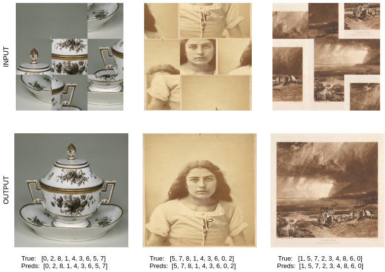

# JigSolver - A Transformer based Image Jigsaw Solver

## About
This project aims to make a data-driven machine learning model that can solve 3\*3 jigsaw puzzles. For this, we used a standard CNN model for extracting features from different regions of the image. After that, the Transformer model is used to relate distinct image regions with each other. Finally, the output of the Transformer is passed to an MLP layer that predicts the correct position for the image regions. 

Code can be found in my another [repo](https://github.com/i-m-vivek/deep-learning-mini_projects/blob/master/VGG_MET_Image_Jigsaw_Solver_with_Transformer_3_3_v1_0.ipynb). Pretrained model is available at this [link](https://drive.google.com/file/d/1WUTiIvY0B3CH9GBXIociUa53DdIUiyo9/view?usp=sharing). Code setup details are coming soon :) 

#### To Do 
- [x] Upload pretrained models
- [ ] Add data generation script
- [ ] Make a GUI for creating and automatic solving the  jigsaw. 
